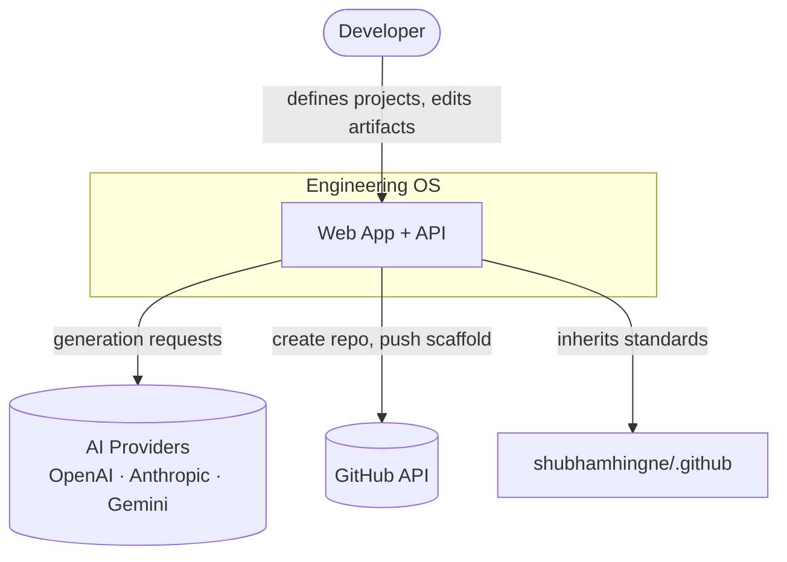
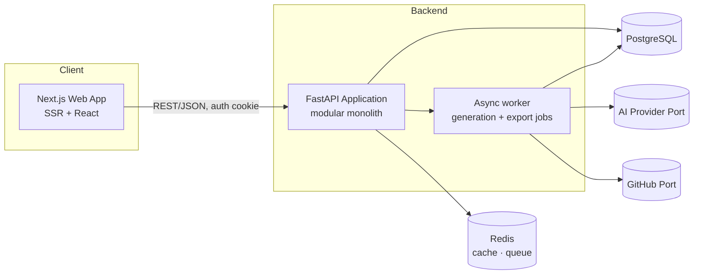
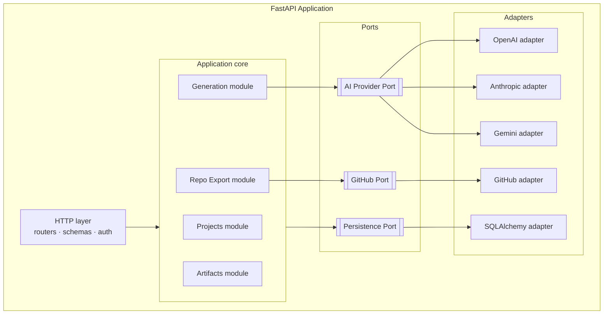

# 08 — System Architecture

The architectural overview for Engineering OS. Detailed decisions live in the
[ADRs](adr/); this document ties them together.

## Architecture principles (non-negotiable)

These constrain every decision below. A design that violates one is rejected.

1. **AI is an assistant, not the source of truth.** Generated artifacts are always editable
   and version-controlled. The human is editor-in-chief.
2. **Deterministic and reproducible where possible.** Generations record their inputs
   (prompt version, model, parameters, seed where supported) so a run can be explained and,
   where the provider allows, repeated.
3. **Everything generated belongs in Git.** Artifacts are Markdown; there is no hidden state.
   The database is an index and cache over content that can always be exported to a repo.
4. **Every AI action is observable.** Each generation emits logs, a trace, and metrics for
   tokens, cost, and latency. An unobserved AI call is a defect.
5. **Providers are replaceable.** AI providers (OpenAI, Anthropic, Gemini) sit behind a
   single port. Adding or swapping a provider is a configuration/adapter change, never a
   redesign. No vendor lock-in.

## Architecture style

A **modular monolith** with a **hexagonal (ports & adapters)** core. One deployable backend,
internally organized into modules with explicit boundaries; all external systems (AI
providers, GitHub, storage) are reached through ports with swappable adapters.

This gives the modularity and replaceability the principles demand without the operational
cost of microservices at MVP scale. See [ADR-0001](adr/0001-architecture.md).

## C1 — System context

## C2 — Container diagram

> Redis and the worker are introduced for streaming generations and async repo export. At the
> smallest scale they can run in-process; the boundary is kept explicit so they can be split out.

## C3 — Backend component diagram

## Quality attributes (and how the design meets them)

| Attribute | How it is achieved |
|---|---|
| Modularity | Hexagonal core; modules communicate via interfaces, not direct coupling |
| Replaceability | Providers behind a single port (Principle 5) |
| Observability | Generation pipeline emits logs/traces/metrics (Principle 4, [17](17-observability.md)) |
| Reproducibility | Runs persist prompt version, model, params (Principle 2) |
| Security | Encrypted tokens, scoped GitHub access, prompt-injection controls ([16](16-security-model.md)) |
| Evolvability | Ports for AI/GitHub/persistence; modular monolith splits cleanly if needed |

## How future additions fit without redesign

- **More AI providers** → new adapter behind the AI port.
- **Mobile clients** → consume the same REST API; no backend change.
- **Plugins** → a plugin port + registry; artifacts/templates already modular.
- **Team workspaces** → a `Workspace` aggregate already scopes ownership (see [10](10-domain-model.md)).

## Related documents

[ADRs](adr/) · [Domain model](10-domain-model.md) · [Database](11-database-design.md) ·
[API](12-api-specification.md) · [Folder structure](13-folder-structure.md) ·
[Sequence diagrams](14-sequence-diagrams.md) · [Deployment](15-deployment-architecture.md) ·
[Security](16-security-model.md) · [Observability](17-observability.md) ·
[Performance budget](18-performance-budget.md)
