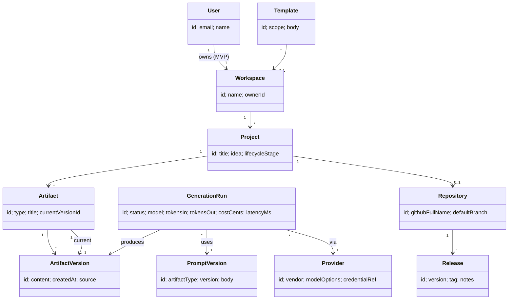
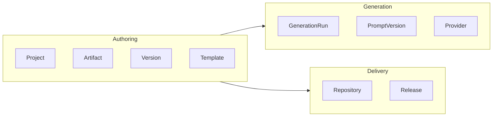

# 10 — Domain Model

The domain is modeled around **engineering artifacts**, not conversations (Principle 3, and the
product's core positioning). A "chat" is, at most, an input to producing an artifact — it is
never the unit of value.

## Ubiquitous language

| Term | Meaning |
|---|---|
| **Workspace** | Ownership boundary for projects (one personal workspace per user in MVP; teams in v2) |
| **Project** | A single software effort moving through the lifecycle |
| **Artifact** | A durable, versioned engineering document (Vision, PRD, ADR, README, …) |
| **Artifact Version** | An immutable revision of an artifact's content |
| **Template** | A reusable blueprint for an artifact type or a whole project |
| **Prompt Version** | A versioned prompt used to generate an artifact type (enables reproducibility) |
| **Generation Run** | One execution of a prompt against a provider/model producing artifact content |
| **Provider** | A connected AI vendor + the user's credential and model options |
| **Repository** | A GitHub repo created/linked for a project |
| **Release** | A tagged version of a project's repository |

## Aggregates and relationships

## Aggregate boundaries

- **Project** is the primary aggregate root: it owns its Artifacts (and their Versions) and at
  most one Repository. Changes to a project's artifacts are made through the project.
- **Artifact** is an entity within Project; **ArtifactVersion** is immutable (append-only
  history → Principle 1 & 3).
- **GenerationRun** is its own aggregate (an audit/observability record) that *references* the
  ArtifactVersion it produced; it is never mutated after completion.
- **Provider** and **Template** are workspace-scoped and shared across projects.

## Key invariants

- An Artifact's `currentVersionId` must point to one of its own versions.
- ArtifactVersions are immutable; "editing" creates a new version (`source = human | ai`).
- A GenerationRun always records `promptVersion`, `provider`, `model`, tokens, cost, latency
  (Principles 2 & 4) — even on failure.
- A Project can be exported to a Repository only when its required artifacts exist.
- Deleting a Project cascades to its Artifacts/Versions; the Repository link is removed but the
  GitHub repo is never auto-deleted.

## Bounded contexts

The contexts map cleanly to the backend modules in [13 — Folder structure](13-folder-structure.md)
and reinforce that conversations are not a domain concept — generation is a service that yields
versioned artifacts.
