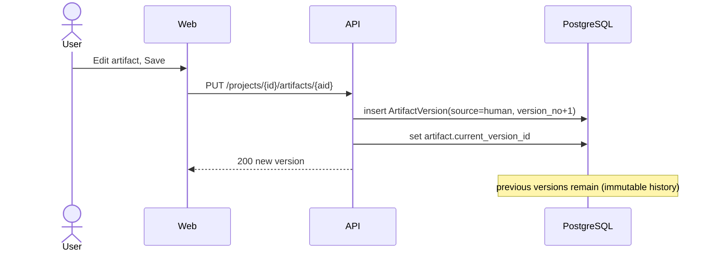
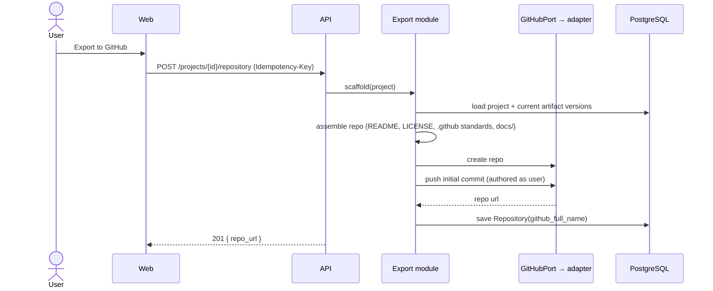

# 14 — Sequence Diagrams

The four flows that define the MVP. Every AI flow records observability data (Principle 4) and
yields a versioned artifact in Git, not a transient message (Principle 3).

## 1. AI artifact generation (request flow + AI pipeline)

```mermaid
sequenceDiagram
    actor U as User
    participant W as Web (Next.js)
    participant A as API (FastAPI)
    participant G as Generation module
    participant P as AIProviderPort → adapter
    participant DB as PostgreSQL
    participant O as Observability

    U->>W: Generate PRD (select model)
    W->>A: POST /projects/{id}/runs (SSE)
    A->>G: start run(project, artifact_type, model)
    G->>DB: create GenerationRun(status=running, prompt_version, provider, model)
    G->>P: generate(prompt, model, params)
    loop streaming tokens
      P-->>G: token
      G-->>W: SSE event: token
      W-->>U: live text
    end
    P-->>G: completion (usage)
    G->>DB: insert ArtifactVersion(source=ai); set artifact.current_version
    G->>DB: update GenerationRun(status=done, tokens, cost, latency)
    G->>O: emit log + trace + metrics (tokens, cost, latency)
    G-->>W: SSE event: done (version_id, run_id, cost)
    W-->>U: artifact saved (editable)
```

## 2. Human edit (AI is an assistant, not the truth — Principle 1)



## 3. Repository export / scaffold



## 4. Authentication (GitHub OAuth + session)

```mermaid
sequenceDiagram
    actor U as User
    participant W as Web
    participant A as API
    participant GH as GitHub OAuth
    participant DB as PostgreSQL

    U->>W: Sign in with GitHub
    W->>A: GET /auth/github
    A->>GH: OAuth authorize (min scope)
    GH-->>A: callback(code)
    A->>GH: exchange code → token
    A->>DB: upsert user; store encrypted GitHub token
    A-->>W: Set-Cookie (HTTP-only session)
    W-->>U: signed in
```

All four flows are consistent with the [component diagram](08-system-architecture.md) and the
[API spec](12-api-specification.md): every external call goes through a port, and every AI run
is persisted and observed.
