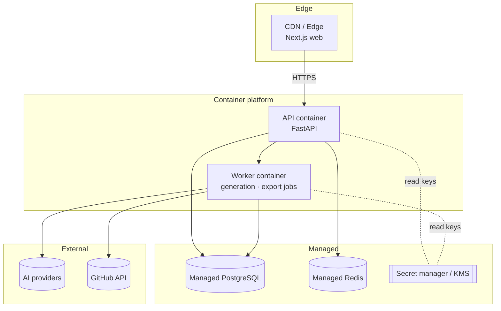
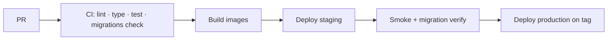

# 15 — Deployment Architecture

Reproducible, container-based, managed services for stateful pieces. One environment topology,
parameterized per stage.

## Topology

## Hosting choices

| Component | Host | Why |
|---|---|---|
| Web | Vercel (or any edge/Node host) | First-class Next.js, SSR/streaming, global edge |
| API + Worker | Container platform (Fly.io / Render / Railway) | Long-lived streaming + async jobs; Docker reproducibility |
| PostgreSQL | Managed (Neon / Supabase / RDS) | Backups, PITR, no DB ops |
| Redis | Managed (Upstash / managed) | Streaming buffers, queue, rate limits |
| Secrets | Platform secret manager / KMS | Envelope-encryption keys, provider keys |

> All replaceable — nothing depends on a specific vendor's proprietary API. The same Docker
> images run locally via `docker-compose`.

## Environments

| Env | Purpose | Data |
|---|---|---|
| Local | Dev via docker-compose | Disposable |
| Staging | Pre-prod verification, migrations dry-run | Synthetic |
| Production | Live | Backed up, PITR |

Config is environment-driven (12-factor); no secrets in images or code.

## CI/CD

- CI gates merges (from the `.github` standards). Images built once, promoted across stages.
- DB migrations run as a gated step; reversible and verified on staging first.
- Production deploy is triggered by a SemVer tag (see [Release Process](https://github.com/shubhamhingne/.github/blob/main/docs/RELEASE_PROCESS.md)).

## Scaling path

- **Now:** single API + single worker; vertical scale.
- **Next:** scale workers horizontally (generation is queue-fed); add Redis-backed rate limits.
- **Later:** extract the generation service (ADR-0001 revisit criteria) and scale it independently.
