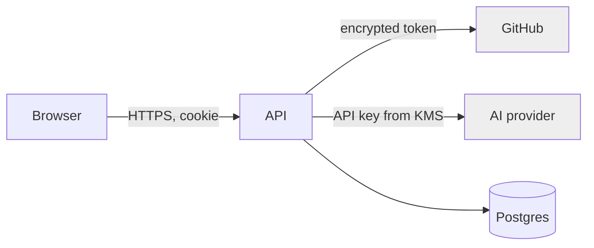

# 16 — Security Model

Security is a first-class concern, not a later hardening pass. This covers identity, secrets,
data, the LLM-specific surface, and supply chain.

## Trust boundaries

Untrusted: the browser and all user/LLM-generated content. Trusted-but-guarded: GitHub and AI
providers (third parties). Secrets never cross into the browser.

## Identity & access (see ADR-0003)

- Sessions in HTTP-only, secure, same-site cookies; passwords hashed with **Argon2id**.
- CSRF protection on all state-changing requests.
- Authorization is **workspace-scoped**: every query is filtered by the caller's workspace;
  no object is reachable across workspaces (prevents IDOR).

## Secrets & tokens

- GitHub OAuth tokens and provider API keys are **envelope-encrypted** (data key per secret,
  master key in KMS); stored as ciphertext (`bytea`), decrypted only in memory at use.
- No secrets in logs, errors, code, or images. Detected by `gitleaks` in pre-commit and CI.
- GitHub access requests **minimum scope**; users can disconnect to revoke and delete tokens.

## Data protection

- TLS in transit; encryption at rest (managed DB + KMS).
- Least-privilege DB credentials per service.
- Deleting a project cascades artifact data; GitHub repos are never auto-deleted.

## LLM-specific threats

| Threat | Control |
|---|---|
| **Prompt injection** (malicious content in a user's idea steering the model) | Treat all artifact content as untrusted; system prompts are isolated and not overridable by user content; outputs are never executed |
| **Sensitive data sent to providers** | Explicit user consent; provider choice surfaced; no silent PII exfiltration; redaction guidance |
| **Output handling** | Generated Markdown is rendered as data, never executed; repo export writes files, runs no generated code |
| **Cost-based abuse** (runaway generations) | Per-run token caps + per-user rate limits ([18](18-performance-budget.md)) |

## Supply chain & dependencies

- Dependabot + secret scanning enabled (from the `.github` standards).
- Pinned dependencies; CI fails on known critical CVEs.
- Third-party adapters (AI/GitHub) isolated behind ports — a compromised SDK has a bounded blast radius.

## Threat model summary (STRIDE)

| Category | Primary mitigation |
|---|---|
| Spoofing | Session cookies, OAuth, Argon2id |
| Tampering | TLS, immutable artifact versions, signed deploys |
| Repudiation | Append-only `generation_runs` audit trail |
| Information disclosure | Encryption at rest/in transit, workspace scoping |
| Denial of service | Rate limits, token budgets, queue backpressure |
| Elevation of privilege | Least-privilege DB + GitHub scopes, no cross-workspace access |

## Future evolution

Move GitHub to a **GitHub App** for short-lived, per-repo tokens (ADR-0003 revisit). Add audit
log export and per-provider data-handling policies when multi-user/team features land.
