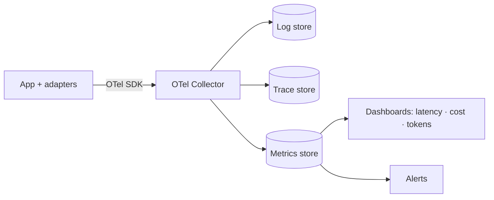

# 17 — Observability

Principle 4: **every AI action is observable.** An AI call without logs, a trace, and
cost/latency/token metrics is a defect. Observability is built into the generation path from
day one, not bolted on.

## Three pillars

| Pillar | Tooling | What we capture |
|---|---|---|
| **Logs** | Structured JSON (one event per line) | Request/response metadata, errors, no secrets/PII |
| **Traces** | OpenTelemetry | End-to-end span per request, including the provider call |
| **Metrics** | OpenTelemetry → Prometheus-compatible backend | Latency, throughput, errors, **AI cost/tokens** |

Everything is correlated by a **trace id** propagated from the web request through the API,
worker, and provider adapter.

## The AI-action record

Every generation persists a `generation_runs` row **and** emits telemetry with:

- `run_id`, `project_id`, `artifact_type`
- `provider`, `model`, `prompt_version`
- `tokens_in`, `tokens_out`, `cost_cents`
- `latency_ms` (and `ttfb_ms` for first token)
- `status` (`done` | `failed`) and `error` on failure

This satisfies reproducibility (Principle 2) and observability (Principle 4) from the same data.

## Key metrics & SLOs

| Metric | Target (SLO) |
|---|---|
| API availability | 99.5% |
| Generation success rate | ≥ 98% |
| Generation time-to-first-token (p95) | < 3 s |
| API p95 latency (non-AI endpoints) | < 300 ms |
| Cost per generation (p95) | within budget ([18](18-performance-budget.md)) |

## Dashboards

- **Cost dashboard:** spend by provider/model/day and per active user — the metric most likely
  to surprise an AI product.
- **Reliability dashboard:** success rate, p95 TTFT, error breakdown by provider.

## Alerting

- Generation success rate < 95% (5-min window).
- p95 TTFT > 5 s.
- Daily AI spend exceeds the configured budget.
- Any unhandled 5xx spike.

## Principles enforced

- **No silent AI calls** — the adapter layer is the single choke point that emits telemetry, so
  a new provider automatically inherits observability.
- **No secrets/PII in telemetry** — enforced by a logging redaction filter and reviewed in code.
