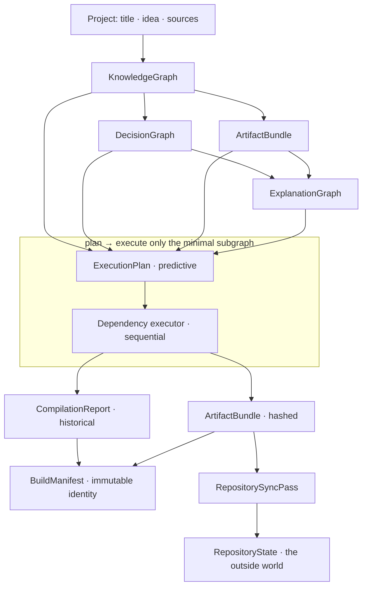
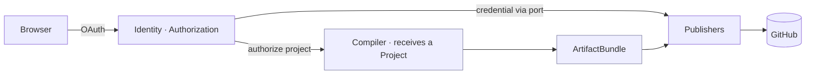
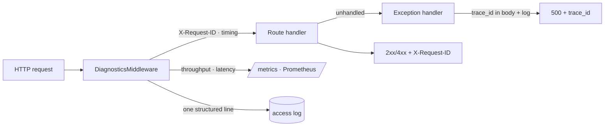
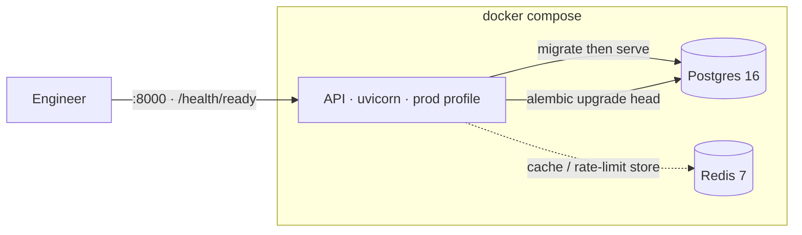

# 22 — Architecture diagrams

Rendered inline by GitHub (Mermaid). They summarize the model specified in
[20 — Compiler specification](20-compiler-specification.md).

## The compilation pipeline

How a project becomes published artifacts — knowledge → plan → execute → identity → sync.

Everything above `RepositoryState` is a completed fact; `RepositoryState` is the one mutable
observation of the world.

## The application boundary

Identity wraps the compiler; the compiler never sees a user or a token.

## Request diagnostics

Every request is correlated; every failure is traceable.

## Deployment topology

`docker compose up` — the API runs migrations, then serves; it waits for a healthy database.

