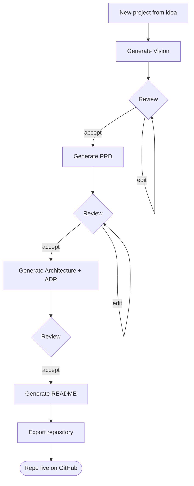
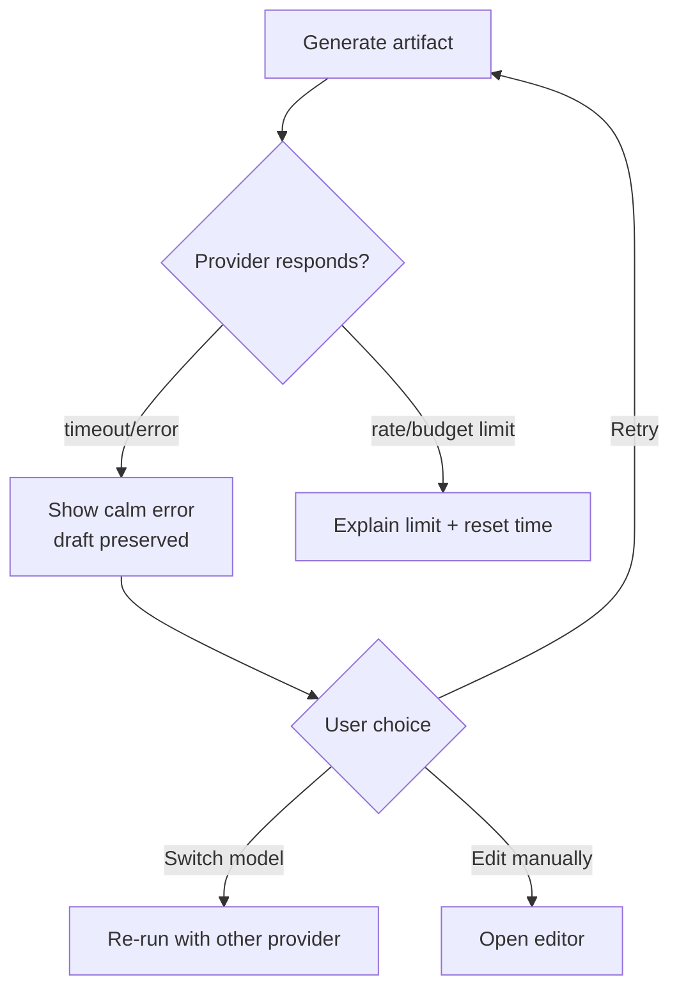
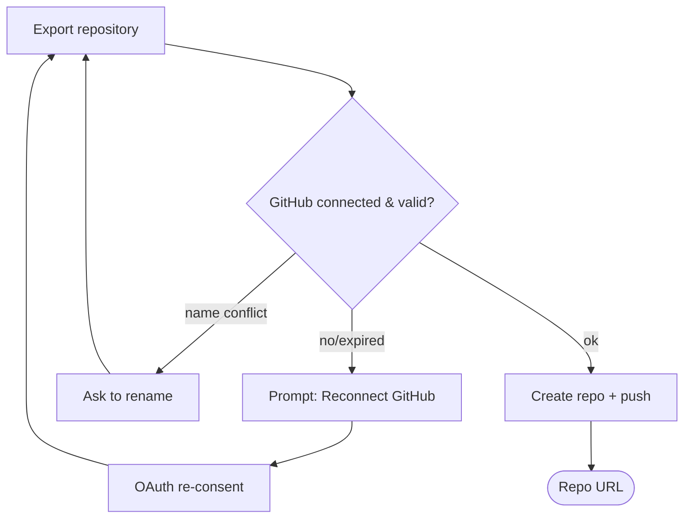
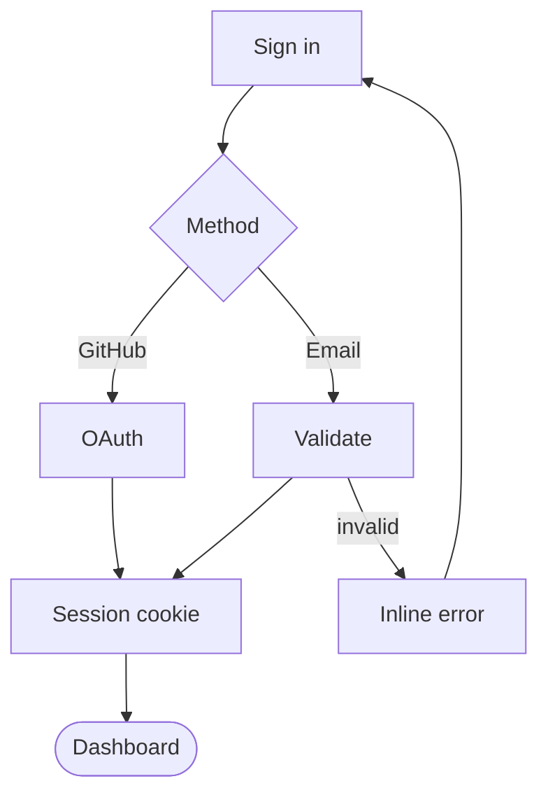

# 15 — User Flows

The key journeys, with **happy paths and failure paths**. A flow that only documents success is
half a design. Diagrams are Mermaid (version-controlled).

## Core flow — idea to repository

The loop is always **generate → review/edit → accept**: the human is editor-in-chief at every
step (Principle 1).

## Failure path — AI generation fails

No work is lost; every failure offers a concrete next step ([12](12-empty-loading-error-states.md)).

## Failure path — GitHub authorization

## Auth flow

## Edge cases captured

- **Empty workspace** → onboarding empty state guides to the first project.
- **Mid-generation navigation** → run continues in background; result persists (no lost work).
- **Concurrent edits to one artifact** → last-saved wins in MVP (single-user); a new version is
  created, history preserved (no destructive overwrite).
- **Provider not configured** → generation is blocked with a clear path to Settings → Connect.

## Why document failure paths

Most of a real product's surface area is the unhappy path. Designing retries, re-auth, limits,
and "your work is safe" up front is what makes the product feel trustworthy — and is exactly the
rigor a Staff Engineer looks for in a portfolio.
