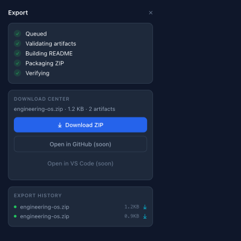
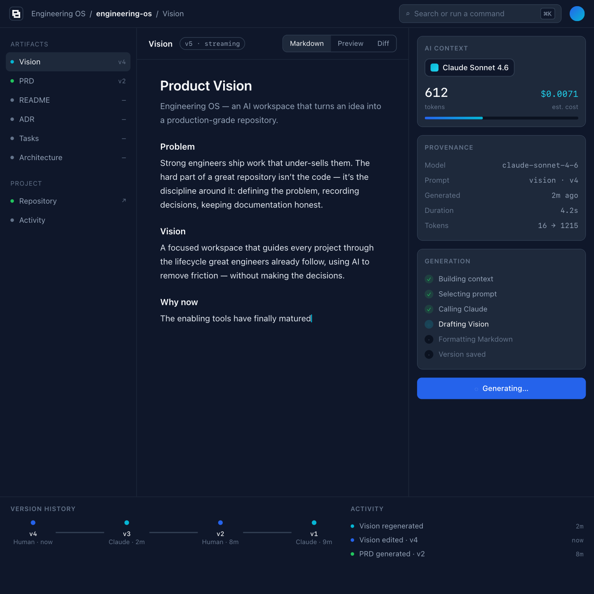
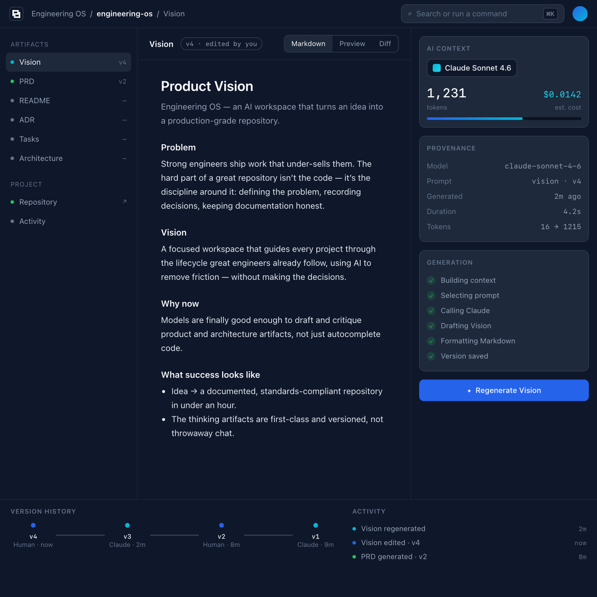
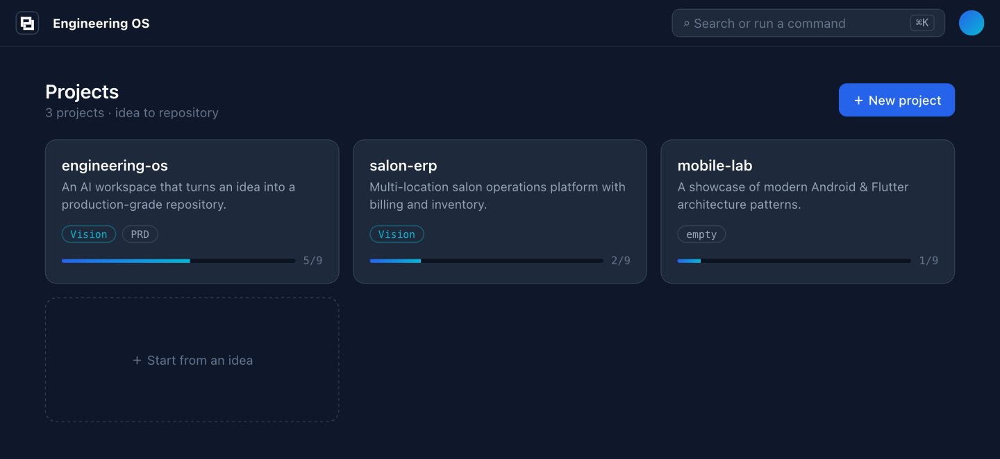
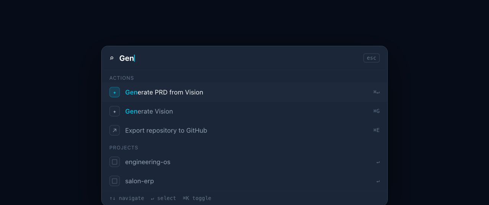

# 06 — Media

Screenshots, recordings, and run evidence referenced across the docs.

## Day 9 — Vertical Slice #1 (Vision workflow)

The first end-to-end workflow is implemented and **proven by tests** (11 passing: unit,
integration, e2e) and a live run.

### Evidence

- **[sample-vision.md](sample-vision.md)** — a real Vision generated by the running API
  (create → generate → edit → save → reopen), captured from the workflow.
- **Test result:** `11 passed` — service unit tests, API integration tests, and the
  end-to-end happy path (`apps/api/tests/`).
- **Observability (Principle 4)** — the structured log emitted during generation:

  ```json
  {"level":"INFO","logger":"eos.generation","msg":"vision.generated",
   "provider":"fake","model":"fake-1","tokens_in":11,"tokens_out":74,"latency_ms":0}
  ```

## Alpha-0.8.x — The typed compiler (symbol table · validator · build log)

The `dict` context became the compiler's **symbol table**: typed `ContextKey` slots, a
`PassDescriptor` per pass, a startup validator, and a generated `CompilationReport`
([ADR-0013](../02-architecture/adr/0013-typed-compiler-context.md)). **57 tests passing.**

- **Startup validation (captured):** an ill-formed pipeline never runs —
  `Compiler((ExtractDecisionPass(),))` ⇒ *"pass 'extract_decision' consumes 'knowledge' but no
  earlier pass produces it"*; two knowledge passes ⇒ *"duplicate producer"*.
- **Build log (`GET /projects/{id}/compilation-report`, captured):**
  ```
  compiler_version: 0.8.x
  extract_knowledge   in=[title, idea, sources]            out=[knowledge]     cache_hit=False
  extract_decision    in=[knowledge]                       out=[decisions]     cache_hit=False
  build               in=[title, idea, sources]            out=[bundle]        cache_hit=False
  explain             in=[knowledge, decisions, sources, bundle]  out=[explanations]  cache_hit=False
  artifacts_generated: 6 | schema_versions: {knowledge: v1, decisions: v1, bundle: v1, explanations: v1}
  ```
- **Forward-compatible:** the executor reads only descriptors, so the future DAG scheduler
  (`build_dependency_graph → topological_sort → run`) changes no pass.

## Alpha-0.8 — Identity, federation, and the compiler boundary

GitHub OAuth, sessions, and project ownership — added as application-layer services that **wrap** the
compiler ([ADR-0012](../02-architecture/adr/0012-identity-federation-boundary.md)). The compiler still
receives only a `Project`. **54 tests passing.**

- **OAuth flow (end to end, fake provider):** `login → 307 to provider (+state cookie) → callback →
  session cookie → GET /auth/me ⇒ {username}`. Real `GitHubOAuthProvider` behind the same port.
- **Ownership (captured):** alice creates a project; bob's session gets `403` on it and an empty list;
  alice still reads it `200`. Authorization lives in one dependency (`get_owned_project`).
- **The boundary, structural:** `authenticate → authorize(project) → compile(project) →
  publish(bundle, credential)`. The `CredentialProvider` seam hands `GitHubPublisher` a token; the
  publisher never imports identity, sessions, or OAuth.
- **Semantic test:** *no GitHub credential on the session → publish returns `400`, not a crash.*

## Alpha-0.7 — Explainability (`ExplanationGraph` + compiler passes)

The compiler can now explain itself ([ADR-0011](../02-architecture/adr/0011-explainability-compiler-passes.md)):
`ExtractKnowledge → ExtractDecision → Build → Explain` runs as a literal sequence of `CompilerPass`es,
emitting a typed `ExplanationGraph`. **43 tests passing.**

- **Explanation (captured from the running pipeline)** — idea + Vision + PRD mention *authentication*
  and *FastAPI*:

  ```
  tech:FastAPI          conf=0.98  sources=['prd','vision']  appears_in=['README.md','docs/ADR-0001.md','docs/prd.md','docs/vision.md']
  topic:authentication  conf=0.98  sources=['prd','vision']  appears_in=['README.md','docs/ADR-0001.md','docs/prd.md','docs/vision.md']
  ```
- Each `Explanation` carries `entity_id · type · summary · evidence · sources · appears_in ·
  related_decisions · confidence` — provenance, not prose. `GET /projects/{id}/explanations` exposes it.
- **Semantic test:** *idea mentions authentication → Vision generated → explanation
  `topic:authentication` has `vision` in sources and `README.md` in `appears_in`, confidence > 0.*

## Alpha-0.6.x — Incremental build pipeline (planner · hashing · diff)

The compiler gained planning + change detection ([ADR-0010](../02-architecture/adr/0010-build-planner-diff.md)):
`Knowledge → BuildPlanner → Renderers → Bundle → DiffEngine → Publishers`. **40 tests passing.**

- **Build plan (captured):** `readme ✓ · adr ✓ · docs ✓ · scaffold ✓ · openapi · skip (no API spec) ·
  diagrams · skip (missing architecture)` — conditional, with reasons.
- **Every artifact is hashed**; the diff engine reports `added / changed / unchanged / removed`.
- **Incremental:** after an export, re-diffing shows *all unchanged* until something actually changes —
  the system knows exactly what would need re-publishing.

## Alpha-0.6 — Semantic build system (renderers + publishers)

Export refactored into **renderers** (produce an explicit `ArtifactBundle`) and **publishers**
(ZIP, GitHub) with a `RendererRegistry` ([ADR-0009](../02-architecture/adr/0009-semantic-build-system.md)).
**34 tests passing.**

- **Bundle (rendered):** `README.md` (synthesized) · `docs/ADR-0001.md` · `docs/vision.md` ·
  `docs/prd.md` · `LICENSE` · `.gitignore`.
- **Publishers:** `ZipPublisher` (real, download) · `GitHubPublisher` (behind a `GitHubClient`
  port; verified via a fake — `create_repo` + `commit_files` → repo URL + commit SHA). Real push
  gated on a token (OAuth in Alpha-0.8).
- **Framing:** Project Knowledge → Semantic Compiler → Artifacts → Publishers (≈ source → compiler → binary).

## Alpha-0.5 — ADR generation (DecisionGraph)

ADRs synthesized through the same pattern as README — `KnowledgeGraph → DecisionExtractor →
DecisionGraph → ADR Renderer` ([ADR-0008](../02-architecture/adr/0008-decision-graph.md)). Graphs are
now **versioned + typed** (`schema_version: v1`). **28 tests passing.**

- **Generated ADR (captured):** `# 0001 — Adopt the project technology stack` with Context · Decision ·
  Alternatives · Consequences · **Provenance**.
- **Semantic:** detected stack (e.g. FastAPI) appears in the Decision; provenance lists its sources.

## Day 14 / Alpha-0.4 — Intelligent README synthesis

README **synthesized from a KnowledgeGraph** ([ADR-0007](../02-architecture/adr/0007-knowledge-synthesis.md)),
not concatenated — semantic, provenance-tracked, and quality-scored. **24 tests passing.**

- **Semantic (captured):** idea mentions *authentication* + *FastAPI* → README contains both.
- **Sections (synthesized):** Hero · Problem · Solution · Features · Architecture · Tech Stack ·
  Getting Started · Roadmap · Documentation · Contributing · License.
- **Quality score:** `80/100` · missing `Architecture · Roadmap · Screenshots`.
- **Provenance (three layers):** `Problem ← vision · Features ← prd · Tech Stack ← vision, prd`.

## Day 13 — Project Export Pipeline

Export modeled as an observable `ExportJob` ([ADR-0006](../02-architecture/adr/0006-export-pipeline.md)),
reusing the streaming infrastructure — a real, downloadable ZIP with history. **19 tests passing.**

- 
- **Live pipeline phases** (captured): `queued → preparing → generating → packaging → verifying → done`
- **Real artifact:** `engineering-os.zip` → `README.md · LICENSE · .gitignore · docs/vision.md · docs/prd.md`
- **Feature Completeness Score:** Product 19 · UX 18 · Engineering 20 · Testing 15 · A11y 8 ·
  Performance 9 · Docs 5 = **94/100** (merge gate ≥ 90; UI a11y/perf verified on a Node run).

## Day 12 — Make it feel alive (streaming + interactions)

Real **streaming generation** (SSE, [ADR-0005](../02-architecture/adr/0005-streaming-generation.md)) —
the artifact grows live and the generation timeline advances through stages. Plus a functional
command palette (⌘K), version diff, and premium empty states. **16 tests passing** (2 streaming).

- 
- **Live SSE event sequence** (captured from the running API):
  ```
  stage×3  →  token×10  →  stage×2  →  done
  (building_context · selecting_prompt · calling_model → tokens → formatting · saved → done)
  ```
- Performance budgets + reports: [performance/](performance/).

## Day 10.5 — Design Sprint (the signature workspace)

High-fidelity mockups of the Engineering Workspace, designed before implementation
([spec](../03-design-system/18-workspace-design-spec.md), [Pro Max standard](../03-design-system/17-ui-ux-pro-max.md)).
Self-contained HTML/CSS in [`design/mockups/`](../../design/mockups/) — they double as the
implementation spec.

- 
- 
- 

The four-zone workspace (tree · editor · AI context · timeline) with live token meter, AI
provenance, generation timeline, and version history — the screen meant to make a reviewer stop
scrolling.

## Day 10 — Vertical Slice #2 (Artifact abstraction + PRD)

`VisionArtifact` was generalized to a typed `Artifact` with immutable version history
([ADR-0004](../02-architecture/adr/0004-artifact-abstraction.md)), and PRD generation was added
on top — no new endpoints, one shared editor. **14 tests passing.**

- **[sample-prd.md](sample-prd.md)** — a PRD generated by the running API *from the project's Vision*.
- **Artifact-centric observability** (live run):
  ```json
  {"msg":"artifact.generated","artifact_type":"prd","provider":"fake","model":"fake-1","tokens_in":51,"tokens_out":55}
  {"msg":"artifact.version.created","artifact_type":"prd","version_no":2,"source":"human"}
  ```
- **Version history** recorded correctly: `prd → [(v2, human), (v1, ai)]`.

### Screen recording (to capture locally)

A 30–60s recording of the UI walkthrough goes here once captured by running the app:

```bash
# terminal 1 — API
cd apps/api && python -m venv .venv && . .venv/bin/activate
pip install -e ".[dev]" && uvicorn engineering_os.main:app --reload
# terminal 2 — web
cd apps/web && pnpm install && pnpm dev   # http://localhost:3000
```

Then record: Dashboard → New project → enter idea → Generate Vision → edit → Save → reopen.
Save as `vision-workflow.gif` / `.mp4` in this folder.

> The backend is runtime-verified here (tests + live run). The web UI is implemented and
> type-safe but built/recorded on a machine with Node installed.
