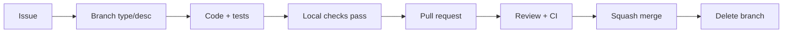

# Development Workflow

How a change goes from idea to merged, consistently, by every contributor (including future you).

## The loop



1. **Issue first** for anything non-trivial (use the inherited issue forms).
2. **Branch** from `main`: `feat/...`, `fix/...`, `docs/...`, `refactor/...`, `chore/...`.
3. **Code with tests** in the same change. Keep PRs small and single-purpose.
4. **Local checks** (pre-commit + tests) before pushing.
5. **PR** using the template; link the issue (`Closes #`).
6. **Review + green CI** required to merge.
7. **Squash-merge** with a Conventional Commit title; branch auto-deletes.

## UI features follow the Pro Max workflow

Any change with a visible surface adds these stages (no UI feature skips them):

```
UX review → interaction design → component design → implementation
→ a11y review → performance review → visual QA → documentation
```

And every UI PR ships **design evidence**: before/after screenshots, a short recording, an a11y
checklist, and responsive validation — saved under [`docs/06-media/`](../06-media/). The full
bar is the [UI/UX Pro Max standard](../03-design-system/17-ui-ux-pro-max.md).

## Every feature follows the repository lifecycle

A feature isn't "done" at code-complete. It follows the same lifecycle as the repo
([Repository Lifecycle](https://github.com/shubhamhingne/.github/blob/main/docs/REPOSITORY_LIFECYCLE.md)):
design intent → implementation → tests → docs updated → (case-study updated if notable).

## Local checks (the fast feedback loop)

```bash
pre-commit run --all-files     # format, lint, secret scan
pnpm --filter web lint && pnpm --filter web typecheck
(cd apps/api && ruff check . && pytest -q)
pnpm check:docs                # doc links
```

Pre-commit runs automatically on commit once installed (`pre-commit install`).

## Conventions (inherited from the org standards)

- **Commits:** Conventional Commits (`type(scope): subject`), authored by you.
- **Branches:** `type/short-description`.
- **PRs:** small, tested, documented; pass the
  [PR checklist](https://github.com/shubhamhingne/.github/blob/main/docs/PULL_REQUEST_CHECKLIST.md).

## Definition of done for a change

Code + tests pass in CI · docs updated where behavior changed · no secrets · self-reviewed ·
Conventional Commit title · meets the
[code-review checklist](https://github.com/shubhamhingne/.github/blob/main/docs/CODE_REVIEW_CHECKLIST.md).
